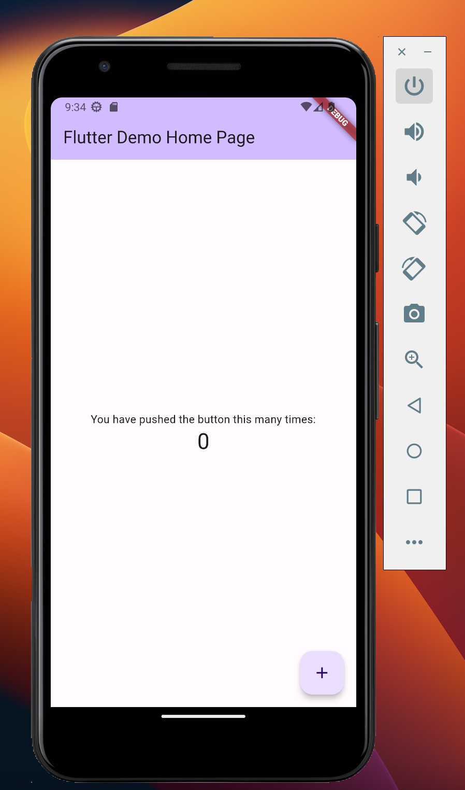
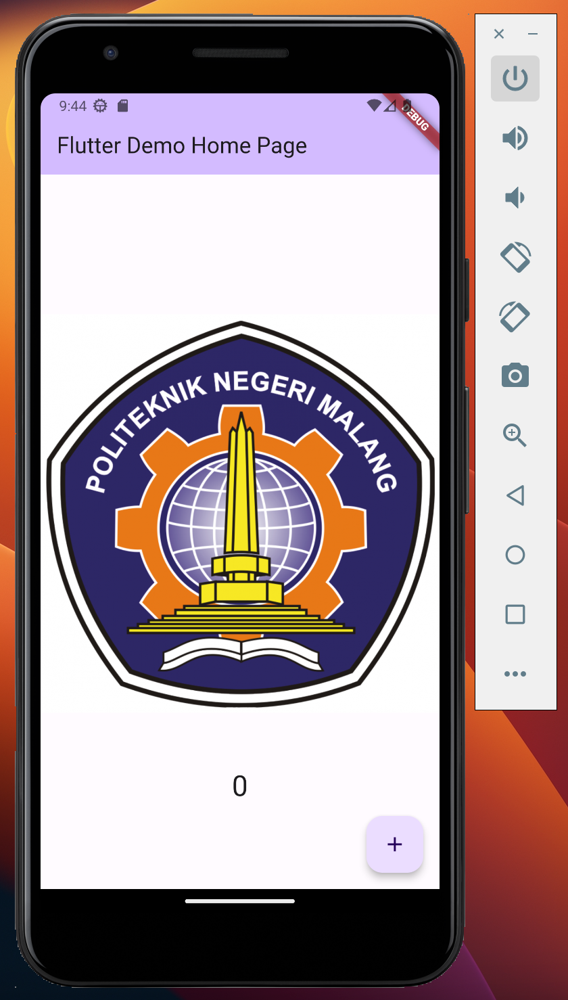
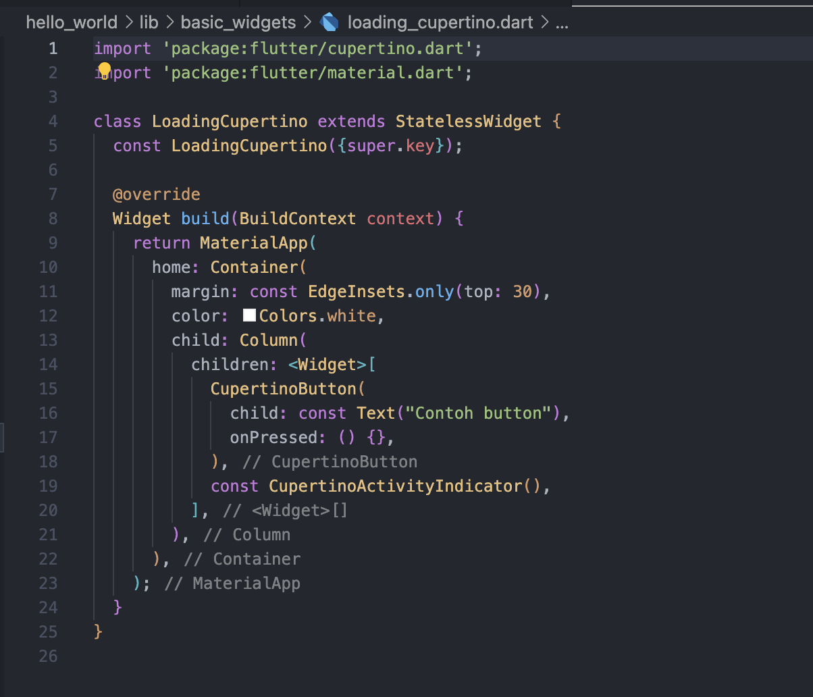
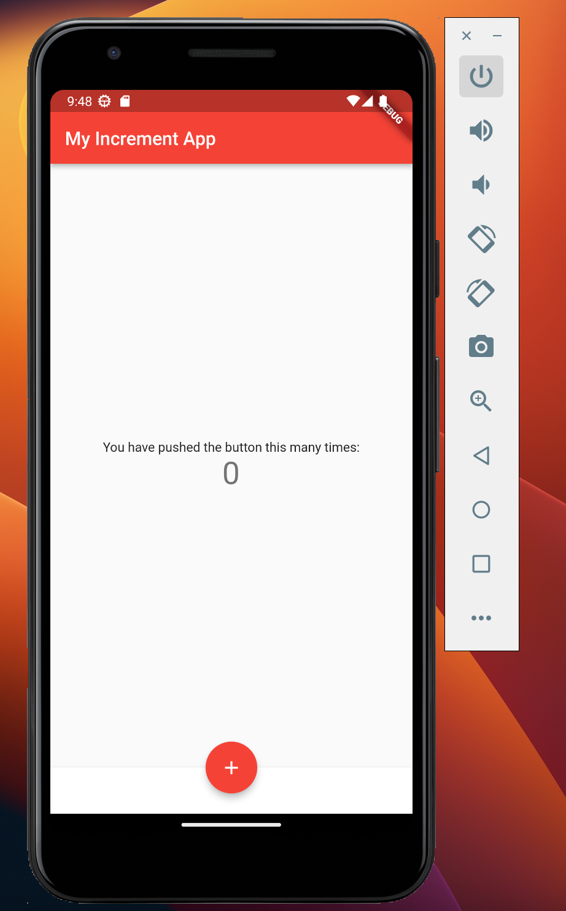
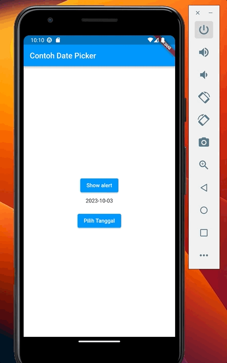
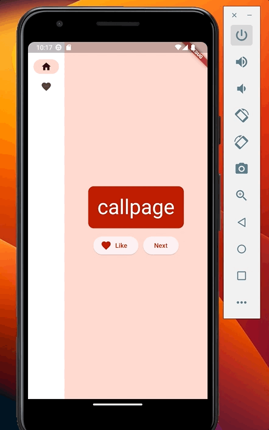

# hello_world

A new Flutter project.

<h1>Praktikum 3</h1>

<h1>Praktikum 4</h1>
<h3>Langkah 1: Cupertino Button dan Loading Bar</h3>

<h3>Langkah 2: Floating Action Button (FAB)</h3>

<h3>Langkah 3: Scaffold Widget</h3>

<h3>Langkah 4: Dialog Widget</h3>

<h3>Langkah 5: Input dan Selection Widget</h3>

<h3>Langkah 6: Date and Time Pickers</h3>

<h1>Tugas Praktikum</h1>

2. Pada praktikum 4 mulai dari Langkah 3 sampai 6, buatlah file widget tersendiri di folder basic_widgets, kemudian pada file main.dart cukup melakukan import widget sesuai masing-masing langkah tersebut!
<h4>Jawaban</h4>

- membuat file my_layout.dart pada basic_widgets
  
- membuat file my_home_page.dart pada basic_widgets
  
- main.dart
  
- output
  

3. Selesaikan Codelabs: Your first Flutter app, lalu buatlah laporan praktikumnya dan push ke repository GitHub Anda!

<h3>Hasil Project</h3>

