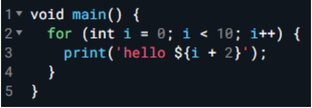
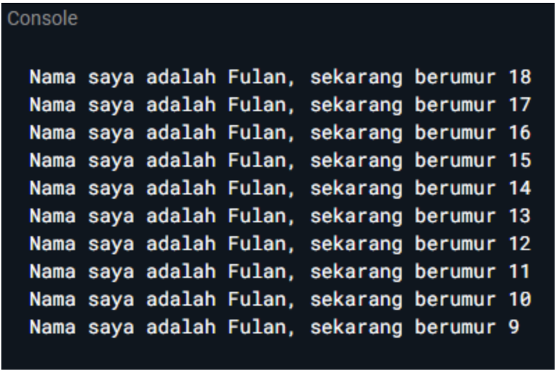
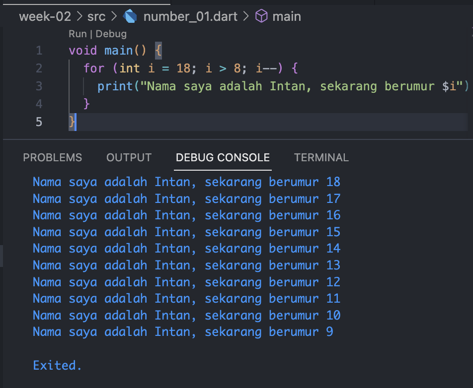
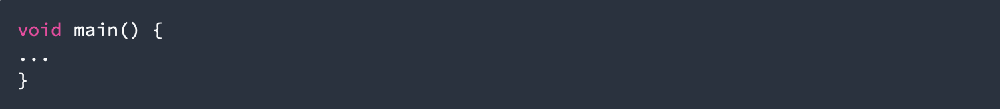

## Authors

- [@DhayuIntan](https://www.github.com/DhayuIntan)

## Soal 1

Modifikasilah kode pada baris 3 di VS Code atau Editor Code favorit Anda berikut ini agar mendapatkan keluaran (output) sesuai yang diminta!

Output yang diminta:

Jawaban:

Pada kode tersebut dilakukan inisialisasi int i, dilakukan perulangan mulai dari 18, hingga i > 8 dengan setiap perulangannya dilakukan decrement(berkurang satu).

## Soal 2

Mengapa sangat penting untuk memahami bahasa pemrograman Dart sebelum kita menggunakan framework Flutter ? Jelaskan!

jawaban:

Karena bahasa yang digunakan pada flutter adalah bahasa Dart. Sehingga, dengan memahami bahasa dart kita akan lebih cepat dalam mempelajari flutter. Selain itu, dart akan digunakan dalam pengembangan aplikasi seperti penggunaan fungsi kustom maupun logika bisnis.

## Soal 3

Rangkumlah materi dari codelab ini menjadi poin-poin penting yang dapat Anda gunakan untuk membantu proses pengembangan aplikasi mobile menggunakan framework Flutter.

## Rangkuman

Untuk memberikan pengalaman terbaik kepada pengembang,, diperlukan bahasa modern tingkat tinggi.Bahasa yang digunakan dalam framework Flutter adalah bahasa Dart.

Dart menggabungkan kelebihan-kelebihan bahasa tingkat tinggi seperti berikut:

- Productive Tooling: untuk menganalisis kode
- Garbage Collection: untukmengelola memori, terutama pada objek yang tidak digunakan
- Type Annotations: untuk keamanan dan konsistensi dalam mengontrol semua data dalam aplikasi
- Statically typed: tipe data harus dideklarasikan secara eksplisitdan tidak dapat berubah setelah dideklarasikan
- Portability: bahasa Dart dapat digunakan pada multiplatform

<h2>Evolusi Bahasa Dart</h2>

Dart diluncurkan pada tahun 2011, merilis versi stabilnya pada tahun 2013, dengan perubahan besar menjelang akhir 2018

Dart awalnya berfokus pada web dan mencoba untuk memecahkan masalah pada javascript. Namun sekarang flutter menjadi bahasa modern yang tangguh, mendukung lintas platform, dan terus meningkatkan fiturnya.

<h2>Bagaimana Dart Bekerja</h2>
Eksekusi kode Dart beroperasi dalam dua mode:

- AOT (Ahead Of Time): kompilator menyediakan file binari dari program dart yang telah dibuat
- JIT (Just In Time): Kompiler memodifikasi kode daripada langsung eksekusinya. Contohnya, jika ika ada 10 file, yang 1 diubah, maka hanya satu file saja yang di compile

Flutter memiliki fitur hot reload yang memungkinkan pengembang untuk mendapatkan umpan balik yang sangat cepat terhadap perubahan kode yang dilakukan, sehingga memungkinkan untuk beralih lebih cepat.

<h2>Memperkenalkan Struktur Bahasa Dart</h2>
Dart dirancang berbasis object-oriented (OO). Pada object oriented, objek dibuat dari blueprint(class), dan setiap objek memiliki fields, dan methods. Sesuai prinsip OO, Dart memiliki fitur encapsulation, inheritance, composition, abstraction, dan polymorphism.

- operator x==y digunakan untuk melakukan perbandingan kesetaraan

<h3>Operator Aritmatika pada Dart</h3>

- \+ untuk tambahan.
- \- untuk pengurangan.
- \* untuk perkalian.
- \/, \% untuk pembagian dan modulus.
- \~/ untuk pembagian dengan pembulatan bagi nilai positif atau negatif.
- \-expression untuk negasi.

Dart juga menyediakan shortcut operator untuk menggabungkan variabel setelah operasi lainnya. Operator aritmatika atau shortcut operator adalah +=, -=, \*=, /=, dan ~/=.

<h3>Operator Increment dan Decrement</h3>

- ++var atau var++ untuk menambah nilai variabel var sebesar 1
- --var atau var-- untuk mengurangi nilai variabel var sebesar 1

<h3>Operator Persamaan dan Relasional</h3>

- == untuk memeriksa apakah operan sama
- != untuk memeriksa apakah operan berbeda
- Operator relasional: <, >, <=, >=

<h3>Operator Logika</h3>

- !expression negasi atau kebalikan hasil ekspresi yaitu, true menjadi false dan false menjadi true.
- OR -> ||
- AND -> &&

<h5>Contoh Penggunaan Main Function pada Dart</h5>

- Tipe data yang dikembalikan dari method perlu didefinisikan terlebih dahulu. Pada kasus ini, void menunjukkan bahwa method tidak mengembalikan data apa pun ketika telah selesai eksekusi.
- Main adalah nama function. Nama tersebut digunakan oleh kode lain untuk merujuk pada nama method ini. Dalam kasus ini, main adalah nama function utama yang dicari oleh Dart VM saat pertama kali mengeksekusi kode.
- Tanda kurung kosong ( ) adalah tempat function untuk mendefinisikan parameter.
- Terakhir, kurung kurawal { } di akhir baris pertama menentukan di mana kode function main dimulai, dan kurung kurawal penutup setelah beberapa baris kemudian untuk menentukan di mana kode function main berakhir.
