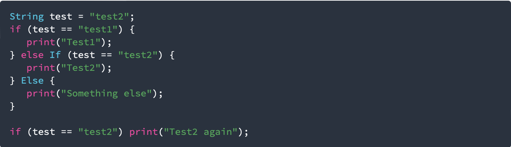

<h1>Praktikum 1: Menerapkan Control Flows ("if/else")</h1>
Selesaikan langkah-langkah praktikum berikut ini menggunakan DartPad di browser Anda.
<h3><b>Langkah 1:</b></h3>
Ketik atau salin kode program berikut ke dalam fungsi main().

<h3><b>Langkah 2:</b></h3>
Silakan coba eksekusi (Run) kode pada langkah 1 tersebut. Apa yang terjadi? Jelaskan!

<h4>Jawaban</h4>

Pada langkah 1 dilakukan pengecekan kondisi melalui if-else. Jika isi dan tipe="test1" maka akan diprint "Test1". Jika isi dan tipe="test2" maka akan diprint "Test2". Selain "test1" dan "test2" maka diprint "Something else". Oleh karena itu output yang dihasilkan pada kondisi if else pertama adalah Test2.

Sedangkan pada pengecekan kondisi berikutnya, dilakukan penyederhanaan penulisan kode seperti if (test == "test2") print("Test2 again");. Artinya, jika test=="test2" bernilai true maka akan diprint "Test2 again".

<h3><b>Langkah 3:</b></h3>

Tambahkan kode program berikut, lalu coba eksekusi (Run) kode Anda.

Apa yang terjadi ? Jika terjadi error, silakan perbaiki namun tetap menggunakan if/else.

<h4>Jawaban</h4>

Terjadi eror karena kondisi harus bertipe boolean, maka kita modifikasi kode tersebut menjadi:

Kode diatas berarti terdapat pengecekan bertipe boolean yaitu jika kondisi(test=="true") bernilai true maka akan diprint "Kebenaran".

<h1>Praktikum 2: Menerapkan Perulangan "while" dan "do-while"</h1>
Selesaikan langkah-langkah praktikum berikut ini menggunakan DartPad di browser Anda.
<h3>Langkah 1:</h3>
Ketik atau salin kode program berikut ke dalam fungsi main().

<h3>Langkah 2:</h3>
Silakan coba eksekusi (Run) kode pada langkah 1 tersebut. Apa yang terjadi? Jelaskan! Lalu perbaiki jika terjadi error.
<h4>Jawaban</h4>
Terjadi eror seperti berikut:

Hal tersebut terjadi karena variable counter yang bertipe int belum diinisialisasi. Maka dilakukan modifikasi kode seperti berikut:

Pada kode tersebut counter diinisialisasi dengan nilai 1, dan terus dilakukan perulangan untuk print counter, dengan setiap perulangan dilakukan increment hingga counter<33.

<h3>Langkah 3</h3>
Tambahkan kode program berikut, lalu coba eksekusi (Run) kode Anda.

Apa yang terjadi ? Jika terjadi error, silakan perbaiki namun tetap menggunakan do-while.

<h4>Jawaban</h4>

Terjadi eror karena variable counter belum diinisialisasi, maka kita modifikasi kode program menjadi seperti berikut:

Counter kita inisialisasi dengan tipe int bernilai 1. Maka pada kode tersebut dilakukan perulangan do-while, yang akan melakukan print dari bilangan 1 hingga counter <77, dimana disetiap perulangan modify(increment++).

<h1>Praktikum 3: Menerapkan Perulangan "for" dan "break-continue"</h1>
Selesaikan langkah-langkah praktikum berikut ini menggunakan DartPad di browser Anda.
<h3>Langkah 1:</h3>
Ketik atau salin kode program berikut ke dalam fungsi main().

</h3>Langkah 2:</h3>
Silakan coba eksekusi (Run) kode pada langkah 1 tersebut. Apa yang terjadi? Jelaskan! Lalu perbaiki jika terjadi error.
<h4>Jawaban</h4>

Terjadi eror karena variable index belum diinisialisasi. Selanjutnya, eror terjadi karena infinity loop yang diakibatkan tidak adanya operasi increment pada setiap perulangan.Maka kita lakukan inisialisasi variable index, dan modifikasi modify seperti berikut.

Pada kode tersebut, dilakukan perulangan for mulai dari 10 hingga index<27, dimana disetiap perulangannya dilakukan increment.

<h3>Langkah 3:</h3>
Tambahkan kode program berikut di dalam for-loop, lalu coba eksekusi (Run) kode Anda.

Apa yang terjadi ? Jika terjadi error, silakan perbaiki namun tetap menggunakan for dan break-continue.

<h4>Jawaban</h4>

Terjadi eror logika(tidak ada output yang keluar). Hal ini karena pada kondisi else if, semua angka yang diprint memenuhi salah satu kondisi yaitu index > 1, sehingga semua angka akan selalu dicontinue ketika diprintkan.

Oleh karena itu, kita lakukan modifikasi kode seperti berikut:

Pada kode tersebut dilakukan perulangan dor mulai dari 1 hingga index<27, dimana pada setiap perulangan dilakukan increment. Selama eksekusi perulangan tersebut terdapat kondisi yaitu jika (index > 1 && index < 7) yang berarti bilangan 2 hingga 6 akan dicontinue(diskip), sedangkan jika index adalah 21 dilakukan pemberhentian perulangan melalui break.

<h1>Tugas Praktikum</h1>

1. Silakan selesaikan Praktikum 1 sampai 3, lalu dokumentasikan berupa screenshot hasil pekerjaan beserta penjelasannya!
2. Buatlah sebuah program yang dapat menampilkan bilangan prima dari angka 0 sampai 201 menggunakan Dart. Ketika bilangan prima ditemukan, maka tampilkan nama lengkap dan NIM Anda.
3. Kumpulkan berupa link commit repo GitHub pada tautan yang telah disediakan di grup Telegram!

<h3>Jawaban</h3>

