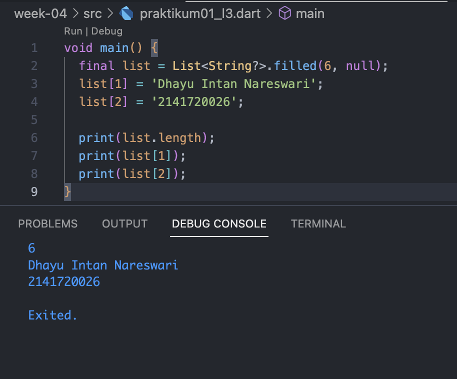
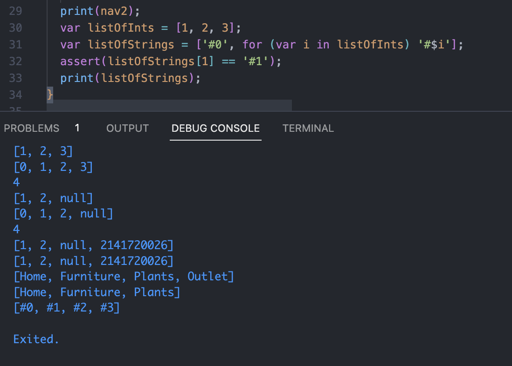
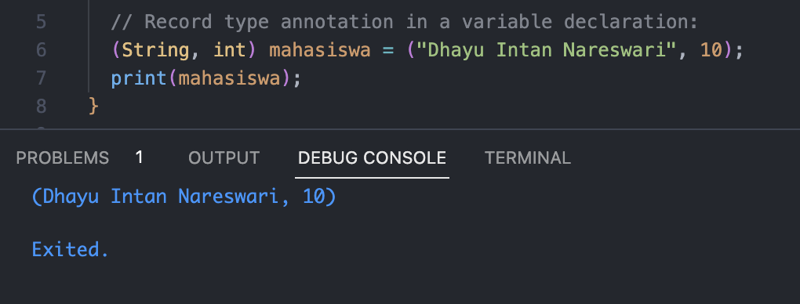
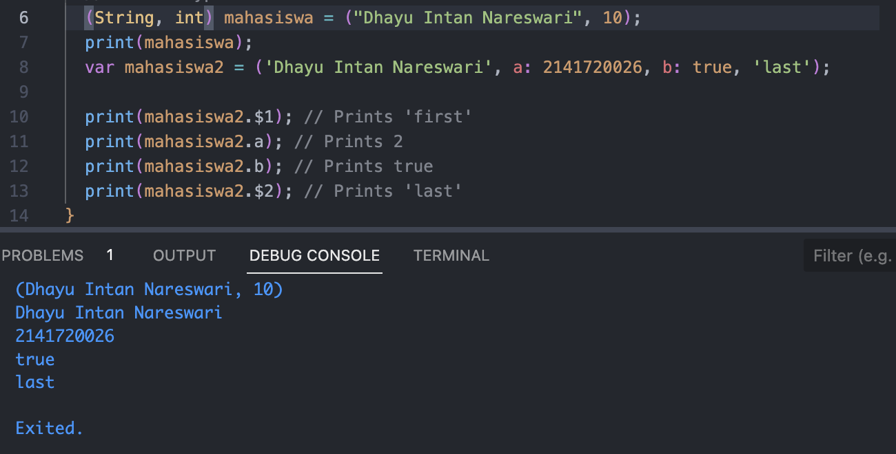

<h1>2. Praktikum 1: Eksperimen Tipe Data List</h1>
Selesaikan langkah-langkah praktikum berikut ini menggunakan VS Code atau Code Editor favorit Anda.
<h3>Langkah 1:</h3>
Ketik atau salin kode program berikut ke dalam void main().

<h3>Langkah 2:</h3>
Silakan coba eksekusi (Run) kode pada langkah 1 tersebut. Apa yang terjadi? Jelaskan!

<h4>Jawaban</h4>

Penggunaan kode assert digunakan untuk memastikan apakah kondisi tersebut benar selama eksekusi program, biasanya digunakan dalam debugging. Pada kode tersebut terdapat list yang berisi tiga variable, sehingga memiliki panjang list tiga. Print pertama digunakan untuk mencetak panjang array yaitu 3, print kedua digunakan untuk mencetak index satu pada list, yaitu 2. Lalu dilakukan modifikasi nilai pada index tersebut, menjadi bernilai 1. Sehingga pada saat print terakhir untuk list berindex satu adalah satu.

<h3>Langkah 3:</h3>
Ubah kode pada langkah 1 menjadi variabel final yang mempunyai index = 5 dengan default value = null. Isilah nama dan NIM Anda pada elemen index ke-1 dan ke-2. Lalu print dan capture hasilnya.

<h1>3. Praktikum 2: Eksperimen Tipe Data Set</h1>
Selesaikan langkah-langkah praktikum berikut ini menggunakan VS Code atau Code Editor favorit Anda.
<h3>Langkah 1:</h3>
Ketik atau salin kode program berikut ke dalam fungsi main().

<h3>Langkah 2:</h3>
Silakan coba eksekusi (Run) kode pada langkah 1 tersebut. Apa yang terjadi? Jelaskan! Lalu perbaiki jika terjadi error.
<h4>Jawaban</h4>

Set merupakan tipe data collection untuk menyimpan nilai yang unik, dan tanpa memperhatikan urutan. Pada set tidak dipedulikan urutan elemennya, dan tidak boleh ada duplikasi nilai. Pada kode tersebut terdapat set halogens yang menyimpan lima nilai didalamnya. Sehingga ketika dilakukan pemanggilan set halogens maka akan muncul nilai-nilai di dalam set tersebut.

<h3>Langkah 3:</h3>
Tambahkan kode program berikut, lalu coba eksekusi (Run) kode Anda.

Apa yang terjadi ? Jika terjadi error, silakan perbaiki namun tetap menggunakan ketiga variabel tersebut. Tambahkan elemen nama dan NIM Anda pada kedua variabel Set tersebut dengan dua fungsi berbeda yaitu .add() dan .addAll(). Untuk variabel Map dihapus, nanti kita coba di praktikum selanjutnya.

Dokumentasikan code dan hasil di console, lalu buat laporannya.

<h4>Jawaban</h4>

Pada kode diatas, dilakukan penambahan pada set names1, yaitu "Dhayu Intan Nareswari", dan pada set names2 dilakukan penambahan nim. Pada set names1 yang awalnya hanya berisi nama saja, ditambahkan dengan nilai yang ada pada set names2 yaitu berisi nim, sehingga sekarang nilai yang ada pada set names1 adalah nama, dan nim.

<h1>Praktikum 3: Eksperimen Tipe Data Maps</h1>
Selesaikan langkah-langkah praktikum berikut ini menggunakan VS Code atau Code Editor favorit Anda.
<h3>Langkah 1:</h3>
Ketik atau salin kode program berikut ke dalam fungsi main().

<h3>Langkah 2:</h3>
Silakan coba eksekusi (Run) kode pada langkah 1 tersebut. Apa yang terjadi? Jelaskan! Lalu perbaiki jika terjadi error.
<h4>Jawaban</h4>

Map merupakan tipe data collection untuk menyimpan data dalam bentuk key-value. Contohnya pada map 'gifts' keynya adalah first, second, dan fifth. Sedangkan nilai yang tersimpan pada key tersebut adalah partriedge untuk key first, turtledoves untuk key second, dan 1 untuk fifth. Sehingga ketika dilakukan print(gifts), maka akan diprint seluruh key dan value yang ada pada maps gifts.

<h3>Langkah 3:</h3>
Tambahkan kode program berikut, lalu coba eksekusi (Run) kode Anda.

Apa yang terjadi ? Jika terjadi error, silakan perbaiki.

Tambahkan elemen nama dan NIM Anda pada tiap variabel di atas (gifts, nobleGases, mhs1, dan mhs2). Dokumentasikan hasilnya dan buat laporannya!

<h4>Jawaban</h4>

Pada kode awal pendefinisian key-value pada map mhs1 dan mhs2 hanya memodifikasi value pada map gifts, dan map nobleGases tapi tidak mendefinisikan key-value pada mapnya sendiri. Oleh karena itu, kode dimodifikasi dengan mengubah menjadi mhs1['key'] = 'value, dan mhs2['key'] = 'value. Selanjutnya masing-masing map ditambahkan key-value nama dan nim dengan menambahkan kode map.addAll({'nama': "Dhayu Intan Nareswari", 'nim': "2141720026"});

<h1>Praktikum 4: Eksperimen Tipe Data List: Spread dan Control-flow Operators</h1>
Selesaikan langkah-langkah praktikum berikut ini menggunakan VS Code atau Code Editor favorit Anda.
<h3>Langkah 1:</h3>
Ketik atau salin kode program berikut ke dalam fungsi main().

<h3>Langkah 2:</h3>
Silakan coba eksekusi (Run) kode pada langkah 1 tersebut. Apa yang terjadi? Jelaskan! Lalu perbaiki jika terjadi error.

Terjadi eror karena list list1 belum dideklarasikan. Sehingga dilakukan modifikasi menjadi:

Pada kode tersebut list list1 berisi nilai 1,2,3. Sedangkan pada list list2 berisi nilai 0, digabungkan dengan nilai-nilai yang ada pada list 1 sehingga berisi nilai 0,1,2,3.

<h3>Langkah 3:</h3>
Tambahkan kode program berikut, lalu coba eksekusi (Run) kode Anda.

Apa yang terjadi ? Jika terjadi error, silakan perbaiki.

Tambahkan variabel list berisi NIM Anda menggunakan Spread Operators. Dokumentasikan hasilnya dan buat laporannya!

Terjadi eror karena null tidak dapat dimasukkan kedalam list yang didefinisikan sistem bertipe int. Oleh karena itu dilakukan modifikasi serta penambahan variabel list berisi nim menggunakan spread operators seperti berikut.

<h3>Langkah 4:</h3>
Tambahkan kode program berikut, lalu coba eksekusi (Run) kode Anda.

Apa yang terjadi ? Jika terjadi error, silakan perbaiki. Tunjukkan hasilnya jika variabel promoActive ketika true dan false.

<h4>Jawaban</h4>
Terjadi eror, karena pada dart tidak dapat menggunakan pernyataan if langsung di dalam inisialisasi list. Oleh karena itu, diperlukan kondisi atau operator ternary untuk menambahkan elemen 'Outlet' ke dalam list berdasarkan nilai promoActive seperti berikut.

<h3>Langkah 5:</h3>
Tambahkan kode program berikut, lalu coba eksekusi (Run) kode Anda.

Apa yang terjadi ? Jika terjadi error, silakan perbaiki. Tunjukkan hasilnya jika variabel login mempunyai kondisi lain.

<h4>Jawaban</h4>
Kode eror karena struktur penggunaan if yang tidak benar dalam inisialisasi list pada Bahasa Dart. OLeh karena itu, dilakukan penambahan operator ternary seperti berikut.

Jika kondisi bukan "manager" maka Inventory tidak akan ditambahkan ke list.

<h3>Langkah 6:</h3>
Tambahkan kode program berikut, lalu coba eksekusi (Run) kode Anda.

Apa yang terjadi ? Jika terjadi error, silakan perbaiki. Jelaskan manfaat Collection For dan dokumentasikan hasilnya.

<h4>Jawaban</h4>

Manfaat penggunaan "collection for" pada kode tersebut adalah untuk membuat listOfStrings dengan lebih efisien dimana didalamnya terdapat perulangan manual untuk mengisinya dengan variable-variable yang ada pada list listOfInts.

<h1>Praktikum 5: Eksperimen Tipe Data Records</h1>
<h3>Langkah 1:</h3>
Ketik atau salin kode program berikut ke dalam fungsi main().

<h3>Langkah 2:</h3>
Silakan coba eksekusi (Run) kode pada langkah 1 tersebut. Apa yang terjadi? Jelaskan! Lalu perbaiki jika terjadi error.
<h4>Jawaban</h4>

Kode tersebut merupakan records yang memiliki sifat agregate yaitu kumpulan data yang mengandung elemen-elemen dengan nilai tertentu, yaitu 'first', 'last', a: 2, dan b: true sehingga memungkinkan penggabungan beberapa nilai terkait dalam satu kesatuan.

<h3>Langkah 3:</h3>
Tambahkan kode program berikut di luar scope void main(), lalu coba eksekusi (Run) kode Anda.

Apa yang terjadi ? Jika terjadi error, silakan perbaiki. Gunakan fungsi tukar() di dalam main() sehingga tampak jelas proses pertukaran value field di dalam Records.

<h4>Jawaban</h4>

<h3>Langkah 4:</h3>
Menambahkan kode program berikut di dalam scope void main(), lalu coba eksekusi.

Terjadi eror karena mahasiswa belum diisi nilai apapun. Oleh karena itu dilakukan perbaikan sebagai berikut.

<h3>Langkah 5</h3>
Dilakukan penambahan kode seperti berikut:

Mengganti salah satu isi record dengan nama dan NIM:

