# layout_flutter

A new Flutter project.

# Praktikum 1: Membangun Layout di Flutter

## Langkah 1: Buat Project Baru

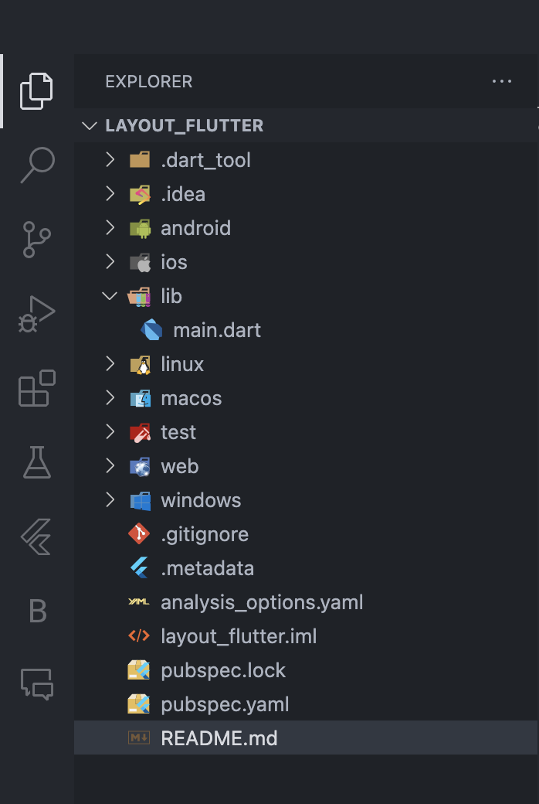

## Langkah 2: Buka file lib/main.dart

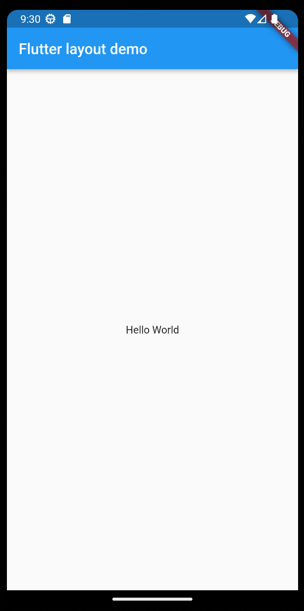

## Langkah 3: Identifikasi layout diagram

Langkah pertama adalah memecah tata letak menjadi elemen dasarnya:

- Identifikasi baris dan kolom.
- Apakah tata letaknya menyertakan kisi-kisi (grid)?
- Apakah ada elemen yang tumpang tindih?
- Apakah UI memerlukan tab?
- Perhatikan area yang memerlukan alignment, padding, atau borders.

## Langkah 4: Implementasi title row

### Soal 1

Letakkan widget Column di dalam widget Expanded agar menyesuaikan ruang yang tersisa di dalam widget Row. Tambahkan properti crossAxisAlignment ke CrossAxisAlignment.start sehingga posisi kolom berada di awal baris.

### Soal 2

Letakkan baris pertama teks di dalam Container sehingga memungkinkan Anda untuk menambahkan padding = 8. Teks ‘Batu, Malang, Indonesia' di dalam Column, set warna menjadi abu-abu.

### Soal 3

Dua item terakhir di baris judul adalah ikon bintang, set dengan warna merah, dan teks "41". Seluruh baris ada di dalam Container dan beri padding di sepanjang setiap tepinya sebesar 32 piksel. Kemudian ganti isi body text ‘Hello World' dengan variabel titleSection seperti berikut:

### Jawaban

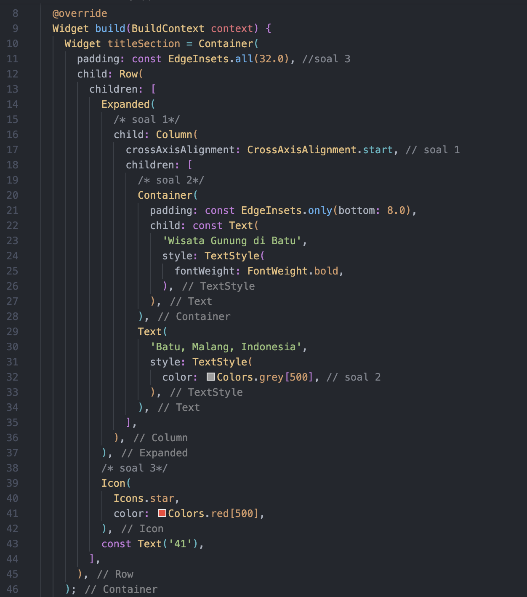
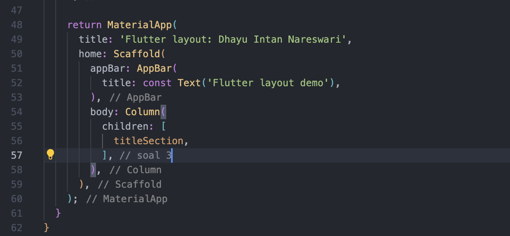

## Output

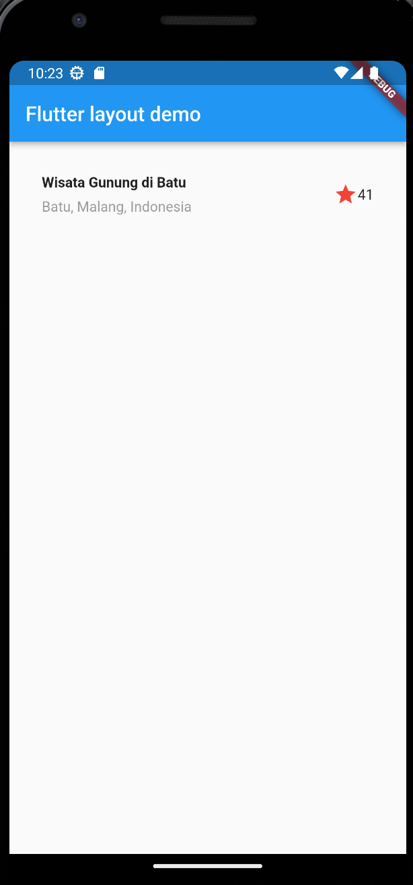

# Praktikum 2: Implementasi button row

## Langkah 1: Buat method Column \_buildButtonColumn

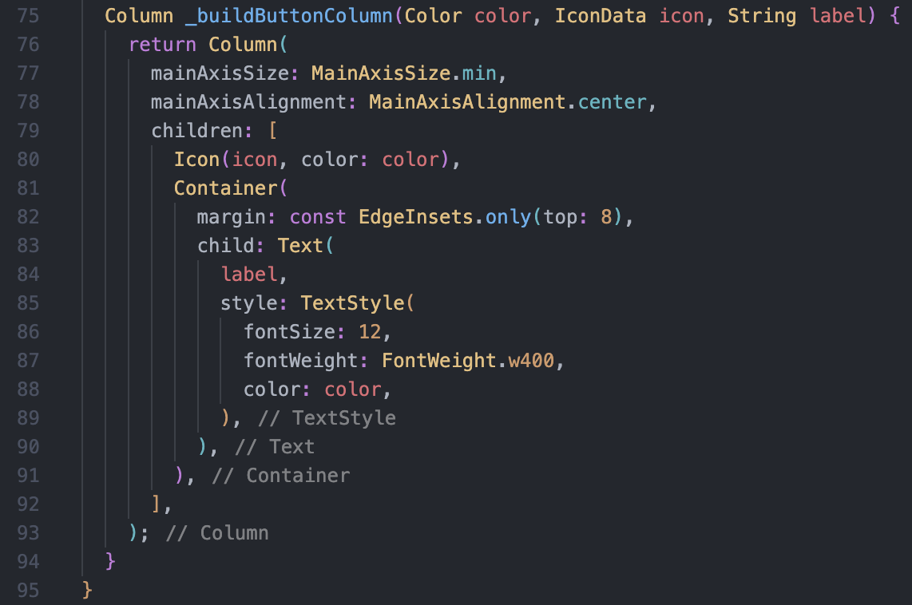

## Langkah 2: Buat widget buttonSection

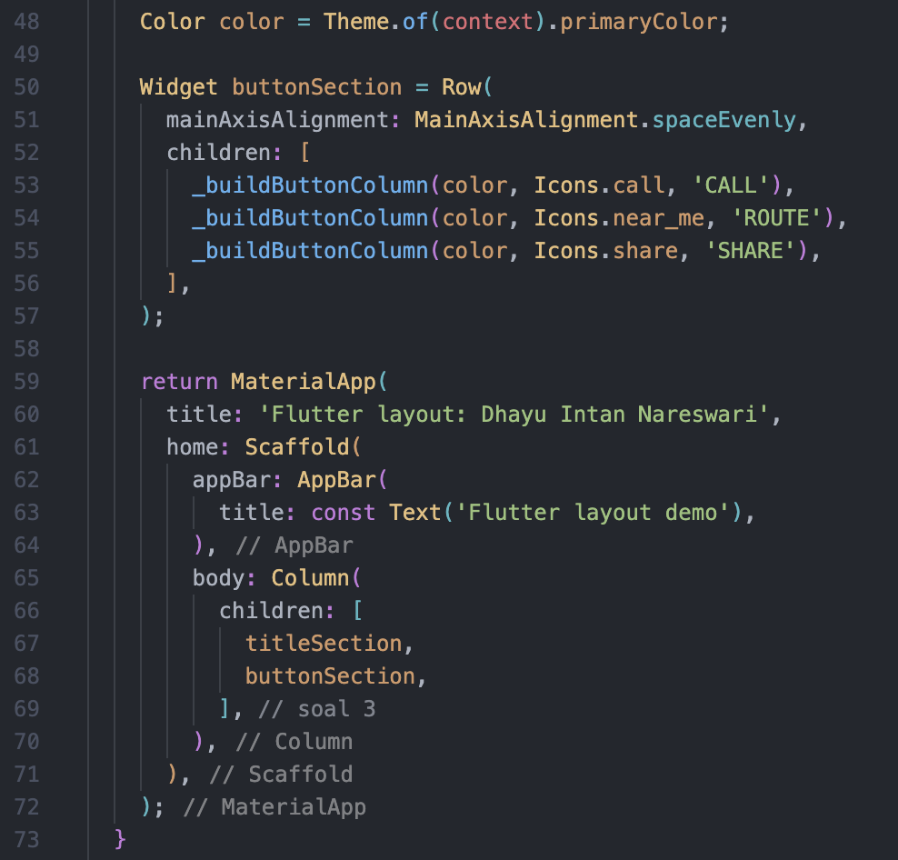

## Langkah 3: Tambah button section ke body

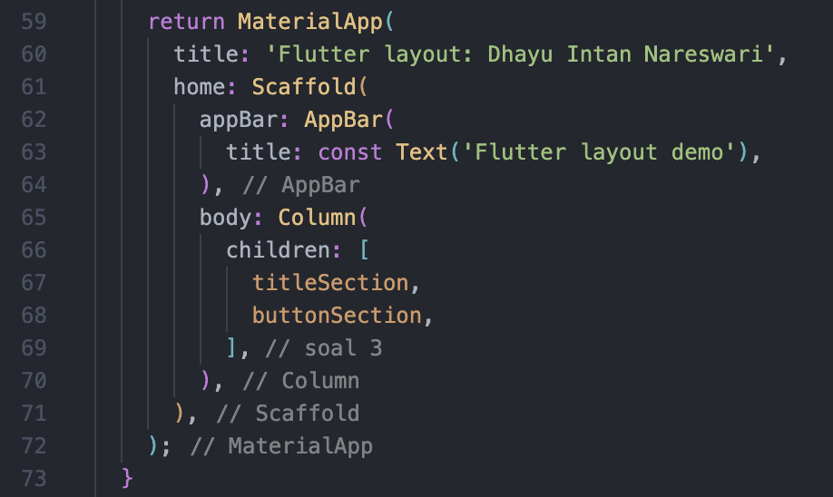

## Output

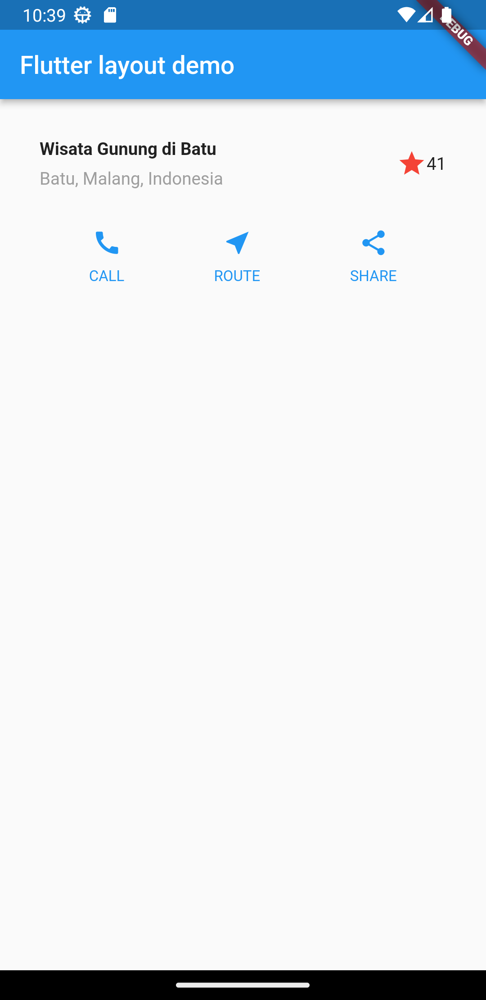

# Praktikum 3: Implementasi text section

## Langkah 1: Buat widget textSection

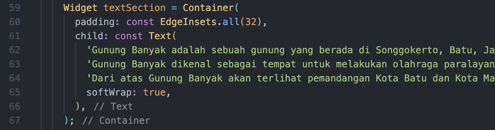

## Langkah 2: Tambahkan variabel text section ke body

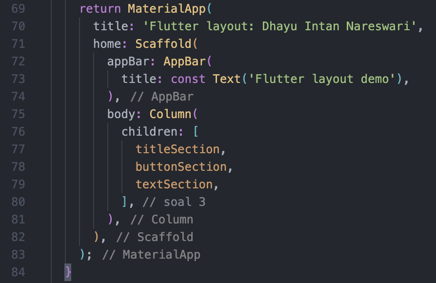

## Output

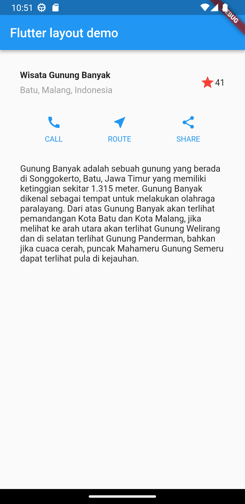

# Praktikum 4: Implementasi image section

## Langkah 1: Siapkan aset gambar

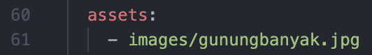

## Langkah 2: Tambahkan gambar ke body

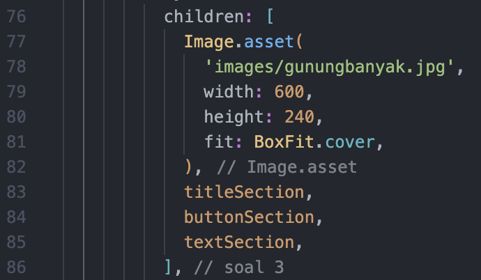

## Langkah 3: Terakhir, ubah menjadi ListView

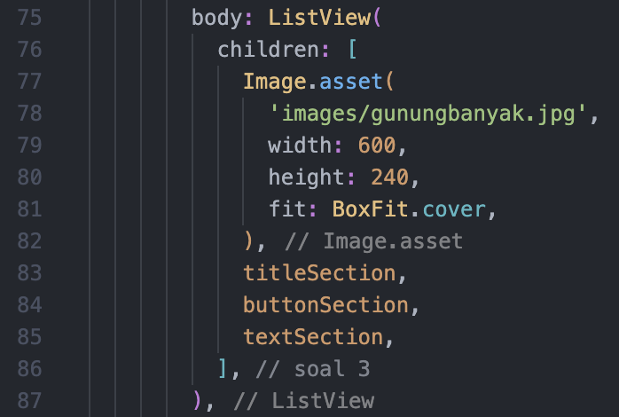

## Output

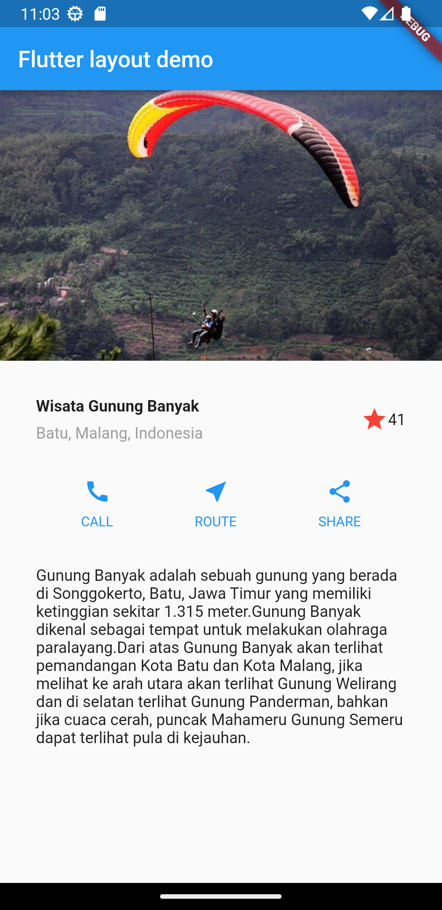

# Tugas Praktikum

Silakan implementasikan di project baru "basic_layout_flutter" dengan mengakses sumber ini:
[https://docs.flutter.dev/codelabs/layout-basics](https://docs.flutter.dev/codelabs/layout-basics)

## Jawab

[basic_layout_flutter](https://github.com/DhayuIntan/2141720026-mobile-2023/tree/a0f0b9be1cb3af8685050f497a0b659fe2a50edb/week-07/basic_layout_flutter.git)
