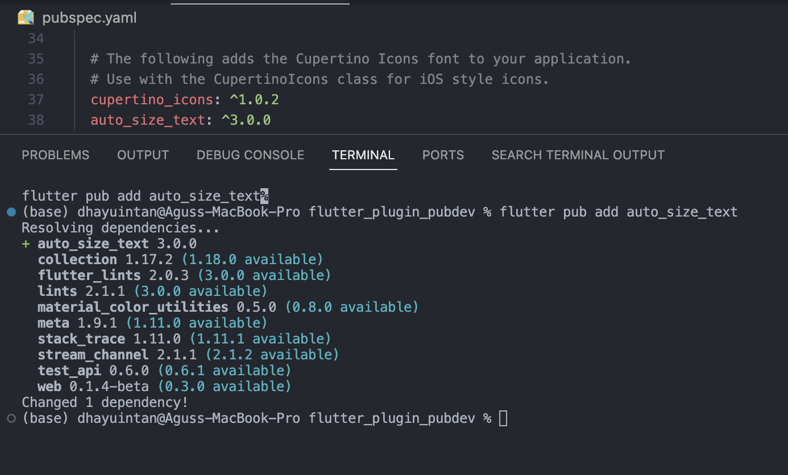
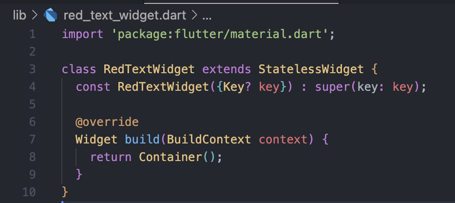
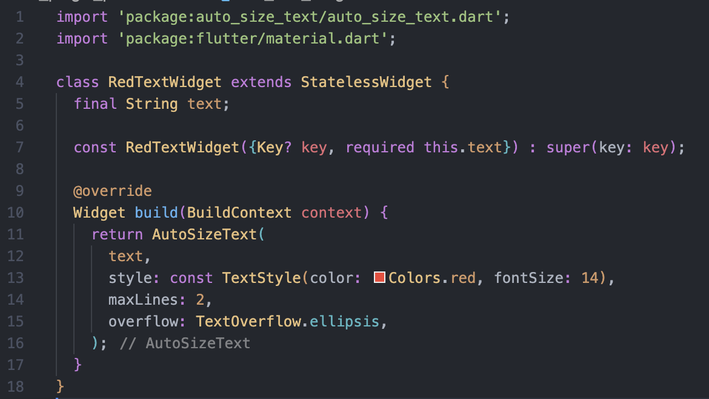
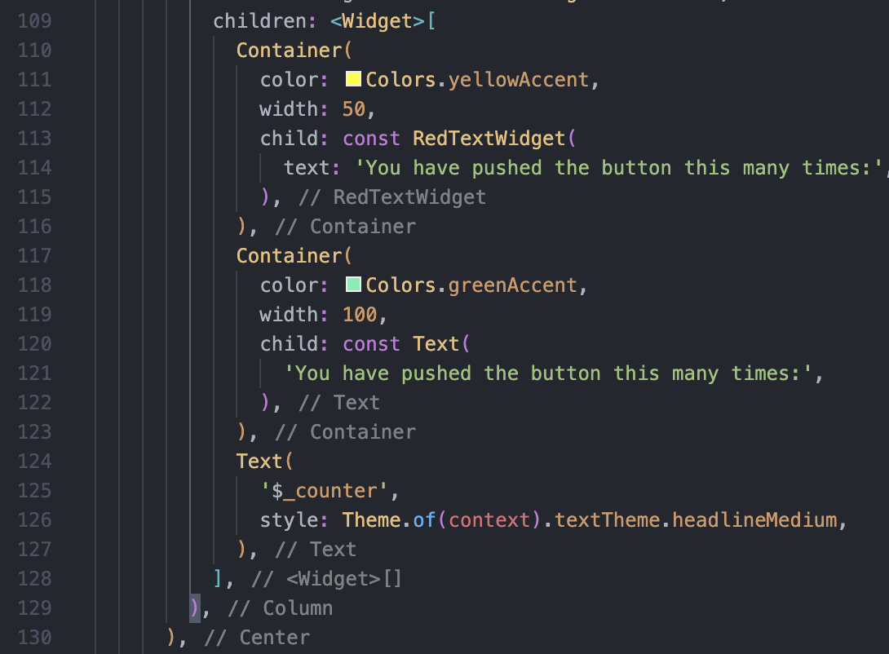
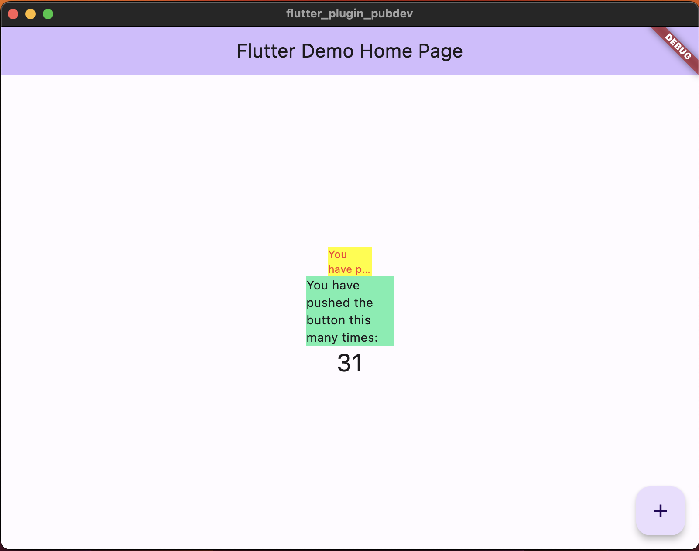

# Praktikum

### Langkah 1: Menambahkan Plugin

### Langkah 2: Buat file red_text_widget.dart

### Langkah 3: Tambah Widget AutoSizeText, dan buat variabel text dan parameter di constructor

### Langkah 4: Tambahkan widget di main.dart

### Hasil Praktikum

# Tugas Praktikum

1. Selesaikan Praktikum tersebut, lalu dokumentasikan dan push ke repository Anda berupa screenshot hasil pekerjaan beserta penjelasannya di file README.md!
2. Jelaskan maksud dari langkah 2 pada praktikum tersebut!
   **Jawaban:**
   Package auto_size_text dapat membuat teks berubah ukurannya secara otomatis sehingga sesuai dengan lebar dan tinggi yang tersedia. Kode flutter pub add auto_size_text digunakan untuk menambahkan package auto_size_text ke dalam proyek Flutter menggunakan package manager pub.
3. Jelaskan maksud dari langkah 5 pada praktikum tersebut!
   **Jawaban:**
   Kode pada langkah 5 digunakan untuk menginisialisasi variable text yang bersifat final, artinya nilainya tidak dapat diubah setelah diberikan nilai awal. Sedangkan const RedTextWidget({Key? key, required this.text}) : super(key: key): digunakan untuk mendefinisikan konstruktor yang menerima parameter text, dimana parameter wajib diisi, sehingga widget ini akan menghasilkan sebuah teks dengan warna merah yang dapat menyesuaikan diri dengan lebar dan tinggi yang tersedia.
4. Pada langkah 6 terdapat dua widget yang ditambahkan, jelaskan fungsi dan perbedaannya!
   **Jawaban:**
   - Container(color: Colors.yellowAccent, width: 50, child: const RedTextWidget(text: 'You have pushed the button this many times:'),): mendefinisikan sebuah Container dengan warna latar belakang kuning dan lebar 50. Di dalam Container tersebut terdapat sebuah widget RedTextWidget yang menampilkan teks "You have pushed the button this many times:" dengan warna merah dan ukuran teks 14.
   - Container(color: Colors.greenAccent, width: 100, child: const Text('You have pushed the button this many times:'),): mendefinisikan sebuah Container dengan warna latar belakang Colors.greenAccent dan lebar sebesar 100. Di dalam Container tersebut terdapat sebuah widget Text yang menampilkan teks "You have pushed the button this many times:" dengan ukuran teks default.
5. Jelaskan maksud dari tiap parameter yang ada di dalam plugin auto_size_text berdasarkan tautan pada dokumentasi ini !
   **Jawaban:**

   - key: mengontrol bagaimana suatu widget menggantikan widget lainnya dalam pohon widget. parameter ini digunakan untuk memastikan bahwa setiap widget AutoSizeText memiliki identitas yang unik dalam pohon widget.
   - textKey: Menetapkan kunci untuk widget Teks yang dihasilkan.
   - style: mengatur gaya atau tampilan teks yang ditampilkan oleh widget AutoSizeText.
   - minFontSize: menentukan ukuran font minimum yang dapat digunakan oleh widget AutoSizeText.
   - maxFontSize: menentukan ukuran font maksimum yang dapat digunakan oleh widget AutoSizeText.
   - stepGranularity: menentukan seberapa banyak ukuran font dikurangi setiap langkah saat mencoba menyesuaikan ukuran teks.
   - presetFontSizes: sebuah daftar yang berisi ukuran font yang telah ditentukan. Ketika menggunakan AutoSizeText, widget akan mencoba setiap ukuran font yang ada dalam daftar ini hingga sesuai.
   - group: mengelompokkan beberapa widget AutoSizeText agar ukuran font yang sama dapat diterapkan pada semua widget yang tergabung dalam group tersebut.
   - textAlign: menentukan perataan teks.
   - textDirection: menentukan arah teks dalam widget AutoSizeText.
   - locale: menentukan bahasa yang digunakan dalam teks.
   - softWrap: membuat teks berpotongan jika tidak memenuhi lebar widget.
   - wrapWords: mengatur apakah teks akan dibungkus (wrap) ke baris baru jika tidak muat dalam lebar yang tersedia.
   - overflow: Bagaimana overflow ditangani.
   - overflowReplacement: Jika teks overflow dan tidak sesuai batasnya, widget ini akan ditampilkan.
   - textScaleFactor: menentukan faktor skala teks. Faktor skala teks ini menentukan seberapa besar teks akan diperbesar atau diperkecil. Parameter ini uga mempengaruhi minFontSize, maxFontSize dan presetFontSizes.
   - maxLines: menentukan jumlah baris paling banyak yang akan dimuat oleh widget.

6. Kumpulkan laporan praktikum Anda berupa link repository GitHub ke spreadsheet yang telah disediakan!
