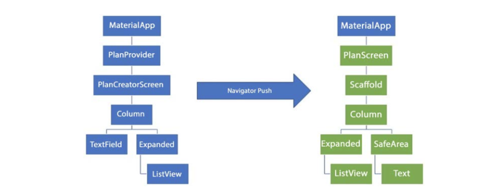

# Praktikum 1: Dasar State dengan Model-View

2. Jelaskan maksud dari langkah 4 pada praktikum tersebut! Mengapa dilakukan demikian?

   <b>Jawaban</b>

   Kode tersebut untuk menciptakan sebuah file nama data_layer.dart di dalam folder models yang isinya terdiri dari perintah plan.dart dan task.dart, yang kemudian akan digunakan di berbagai bagian aplikasi. Dengan ini, saat file data_layer.dart digunakan di bagian lain pada aplikasi, konten dari plan.dart dan task.dart akan menjadi tersedia secara langsung tanpa perlu menuliskan impor khusus untuk kedua file tersebut secara terpisah sehingga saat mengelola impor modul pemanggilan kode menjadi lebih ringkas dan efisien.

3. Mengapa perlu variabel plan di langkah 6 pada praktikum tersebut? Mengapa dibuat konstanta ?

   <b>Jawaban</b>

   Variabel plan diperlukan karena bertindak sebagai penyimpanan dan pembaruan state untuk daftar tugas (tasks) dalam aplikasi. Saat ada perubahan, seperti penambahan atau perubahan status tugas, variabel plan diperbarui menggunakan setState.

4. Lakukan capture hasil dari Langkah 9 berupa GIF, kemudian jelaskan apa yang telah Anda buat!

   <b>Jawaban</b>
   

5. Apa kegunaan method pada Langkah 11 dan 13 dalam lifecyle state ?

   <b>Jawaban</b>

   - Pada langkah 11 method initState() digunakan ketika widget pertama kali dibuat, yaitu untuk inisialisasi data, mempersiapkan objek yang diperlukan, atau melakukan langkah-langkah awal sebelum tampilan diperlihatkan.
   - Pada langkah 13 method dispose() dipanggil ketika widget dihancurkan, yaitu saat widget tidak lagi digunakan. Method ini digunakan untuk digunakan untuk membersihkan sumber daya, menghapus listener, dan melakukan langkah terakhir sebelum widget dihancurkan.

# Praktikum 2: Mengelola Data Layer dengan InheritedWidget dan InheritedNotifier

2. Jelaskan mana yang dimaksud InheritedWidget pada langkah 1 tersebut! Mengapa yang digunakan InheritedNotifier?

   <b>Jawaban</b>

   - InheritedWidget pada langkah 1 adalah PlanProvider yang memungkinkan penyebaran data ke bawah dalam struktur widget Flutter. Saat ada perubahan pada data InheritedWidget, widget turunannya akan di-refresh sesuai dengan perubahan yang terjadi.
   - Dengan menggunakan InheritedNotifier, data dapat dikirimkan ke bawah dalam pohon widget dan, saat ada perubahan pada data yang dipegang oleh ValueNotifier, widget turunannya akan diberitahu dan diperbarui sesuai dengan perubahan yang terjadi.InheritedNotifier menggabungkan fitur distribusi data (InheritedWidget) dengan notifikasi perubahan data (ValueNotifier) dalam struktur widget Flutter.

3. Jelaskan maksud dari method di langkah 3 pada praktikum tersebut! Mengapa dilakukan demikian?

   <b>Jawaban</b>

   - Pada kode tersebut terdapat properti completedCount untuk menghitung jumlah tugas yang telah selesai dikerjakan.
   - Properti completenessMessage digunakan untuk memberikan pesan terkait kelengkapan dari daftar tugas. Pesan ini berisi jumlah tugas yang telah selesai dari total tugas yang ada.

4. Lakukan capture hasil dari Langkah 9 berupa GIF, kemudian jelaskan apa yang telah Anda buat!

   <b>Jawaban</b>
   

# Praktikum 3: Membuat State di Multiple Screens

2. Berdasarkan Praktikum 3 yang telah Anda lakukan, jelaskan maksud dari gambar diagram berikut ini!
   

   <b>Jawaban</b>

   - Gambar pertama terkait dengan manajemen dan penyimpanan data, sedangkan gambar kedua berkaitan dengan interaksi pengguna, menampilkan, dan memungkinkan aksi pengguna untuk menambah dan memilih rencana.
   - Gambar 1:
     - MaterialApp diintegrasikan dengan PlanProvider, yang berfungsi sebagai penyedia informasi rencana.
     - PlanProvider memungkinkan pengaksesan data rencana dari seluruh aplikasi, baik untuk menambah rencana baru atau menampilkan rencana yang sudah ada.
     - berfokus pada manajemen dan distribusi data, dengan menyimpan dan mengelola daftar rencana.
   - Gambar 2:
     - PlanCreatorScreen adalah antarmuka pengguna yang memungkinkan pengguna menambahkan rencana baru.
     - TextField untuk input dan menampilkan daftar rencana dalam ListView.

3. Lakukan capture hasil dari Langkah 14 berupa GIF, kemudian jelaskan apa yang telah Anda buat!

   <b>Jawaban</b>

   
