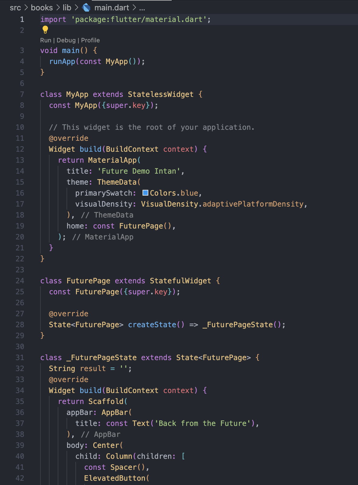
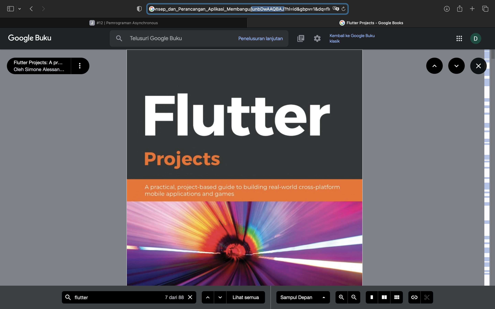
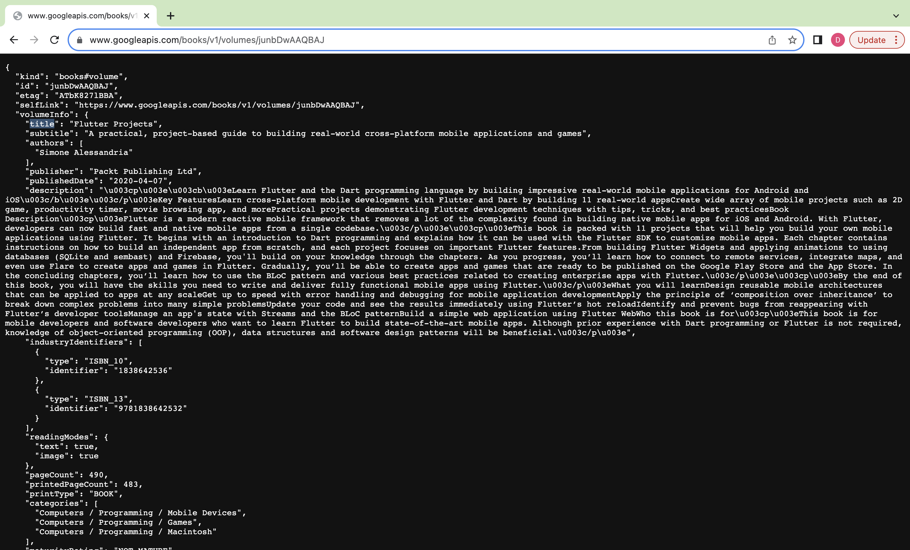
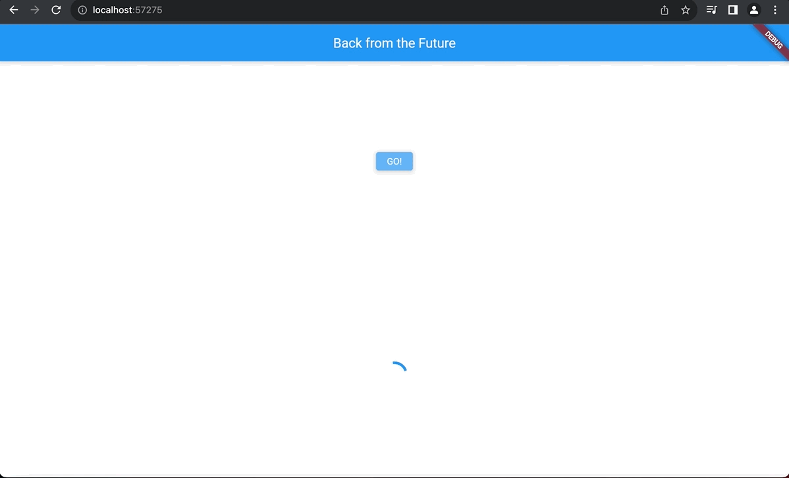
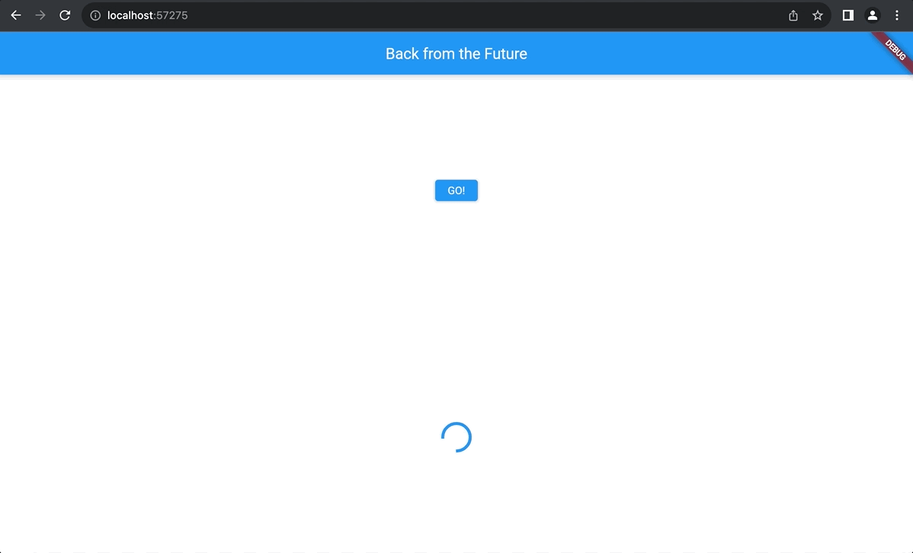
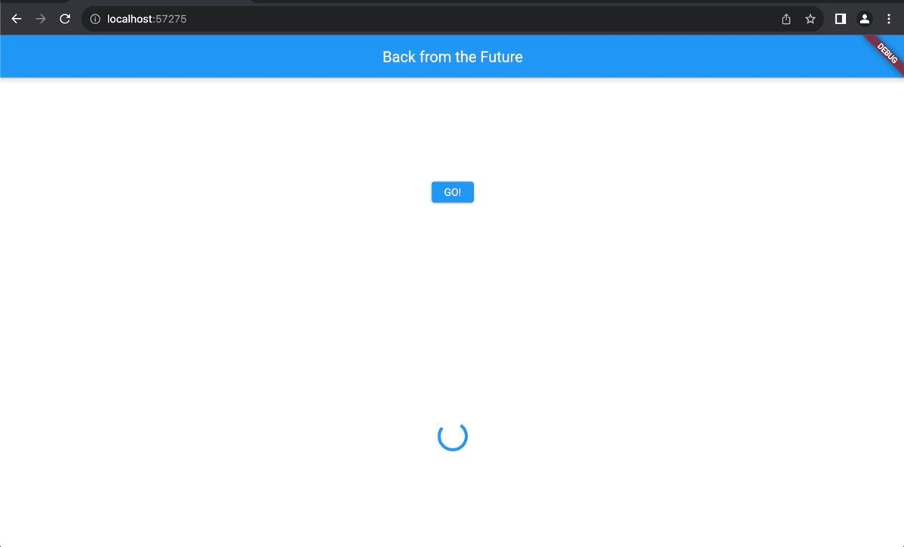
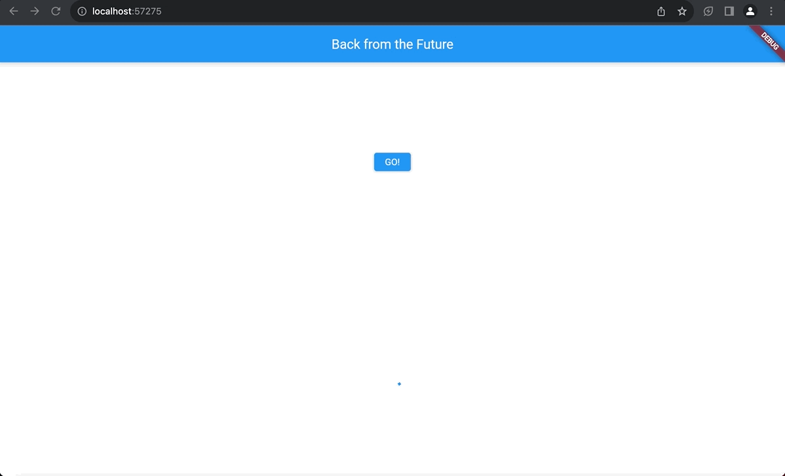

# Praktikum 1: Mengunduh Data dari Web Service (API)

#### 1. Tambahkan nama panggilan Anda pada title app sebagai identitas hasil pekerjaan Anda.

#### <b>Jawab</b>

#### 2. Carilah judul buku favorit Anda di Google Books, lalu ganti ID buku pada variabel path di kode tersebut. Caranya ambil di URL browser Anda seperti gambar berikut ini.

#### <b>Jawab</b>

#### Kemudian cobalah akses di browser URI tersebut dengan lengkap seperti ini. Jika menampilkan data JSON, maka Anda telah berhasil. Lakukan capture milik Anda dan tulis di README pada laporan praktikum. Lalu lakukan commit dengan pesan "W12: Soal 2".

#### 3. Jelaskan maksud kode langkah 5 tersebut terkait substring dan catchError!

#### <b>Jawab</b>

- Masked Substring: digunakan untuk mengambil substring dari karakter pertama hingga karakter ke-n.
- catchError: Jika terjadi kesalahan (error) saat melakukan operasi getData(), maka blok catchError akan dieksekusi.

#### Capture hasil praktikum Anda berupa GIF dan lampirkan di README. Lalu lakukan commit dengan pesan "W12: Soal 3".

#### <b>Jawab</b>

# Praktikum 2: Menggunakan await/async untuk menghindari callbacks

#### 4. Jelaskan maksud kode langkah 1 dan 2 tersebut!

#### <b>Jawab</b>

#### Langkah 1 merupakan tiga fungsi asynchronous (async) yang mengembalikan nilai berturut-turut 1, 2, dan 3 setelah menunda eksekusi selama 3 detik pada masing-masing fungsi. Langkah 2, fungsi count digunakan untuk menghitung total dari tiga nilai asynchronous dan memperbarui tampilan hasilnya menggunakan setState.

#### Capture hasil praktikum Anda berupa GIF dan lampirkan di README. Lalu lakukan commit dengan pesan "W12: Soal 4".

#### <b>Jawab</b>

# Praktikum 3: Menggunakan Completer di Future

#### 5. Jelaskan maksud kode langkah 2 tersebut!

- late Completer completer: Deklarasi objek Completer yang akan digunakan untuk menyelesaikan atau menolak suatu Future pada waktu tertentu.
- Future getNumber() : Fungsi getNumber menginisialisasi objek Completer<int> dan memanggil fungsi calculate, kemudian mengembalikan future dari Completer, yang akan diselesaikan nanti.
- calculate() async : Fungsi calculate adalah fungsi asynchronous yang menunggu selama 5 detik menggunakan await Future.delayed(const Duration(seconds: 5)); dan kemudian menyelesaikan Completer dengan nilai 42 menggunakan completer.complete(42).

#### <b>Jawab</b>

#### Capture hasil praktikum Anda berupa GIF dan lampirkan di README. Lalu lakukan commit dengan pesan "W12: Soal 5".

#### <b>Jawab</b>

#### 6. Jelaskan maksud perbedaan kode langkah 2 dengan langkah 5-6 tersebut!

#### <b>Jawab</b>

Pada fungsi langkah 6 tersebut terdapat blok try-catch di dalam calculate. Jika ada kesalahan selama penundaan, catch akan menangani kesalahan tersebut dan menyelesaikan Completer dengan kesalahan. Pada blok onPressed, jika terjadi kesalahan selama eksekusi getNumber, blok catchError akan menangkap kesalahan tersebut dan mengatur result menjadi 'An error occurred'.

#### Capture hasil praktikum Anda berupa GIF dan lampirkan di README. Lalu lakukan commit dengan pesan "W12: Soal 6".

#### <b>Jawab</b>

# Praktikum 4: Memanggil Future secara paralel

#### 7. Capture hasil praktikum Anda berupa GIF dan lampirkan di README. Lalu lakukan commit dengan pesan "W12: Soal 7".

#### <b>Jawab</b>

#### 8. Jelaskan maksud perbedaan kode langkah 1 dan 4!

#### <b>Jawab</b>

#### Kode 1 lebih fleksibel dengan penambahan Future secara dinamis menggunakan FutureGroup, sedangkan Kode 2 menyediakan cara yang lebih langsung untuk menunggu hasil dari beberapa Future secara bersamaan menggunakan Future.wait.
