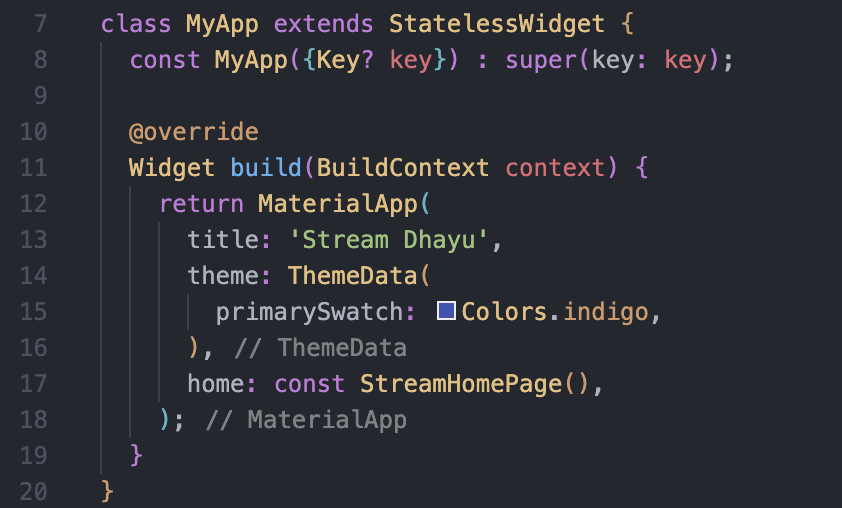
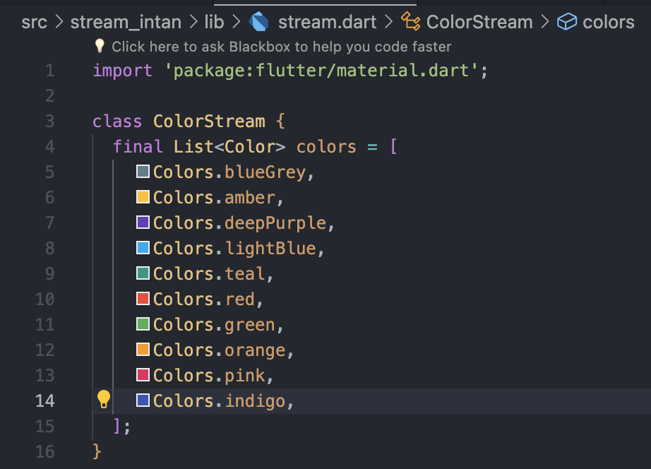

# Praktikum 1: Dart Streams

1. Tambahkan nama panggilan Anda pada title app sebagai identitas hasil pekerjaan Anda.
   Gantilah warna tema aplikasi sesuai kesukaan Anda.

   <b>Jawab</b>
   
   Lakukan commit hasil jawaban Soal 1 dengan pesan "W13: Jawaban Soal 1"

2. Tambahkan 5 warna lainnya sesuai keinginan Anda pada variabel colors tersebut.
   Lakukan commit hasil jawaban Soal 2 dengan pesan "W13: Jawaban Soal 2"

   <b>Jawab</b>
   
