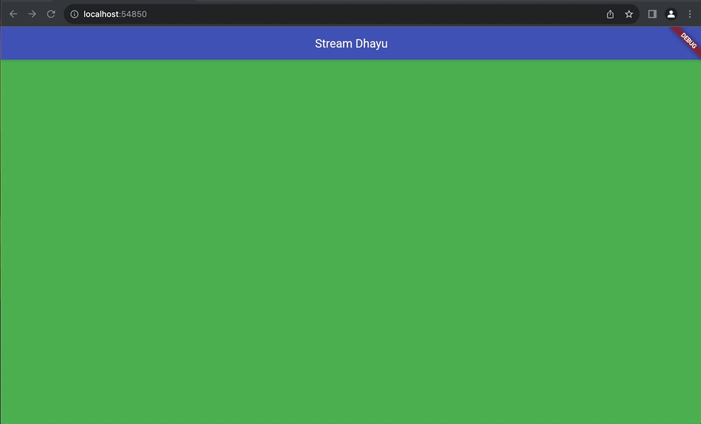

# Praktikum 1: Dart Streams

1. Tambahkan nama panggilan Anda pada title app sebagai identitas hasil pekerjaan Anda.
   Gantilah warna tema aplikasi sesuai kesukaan Anda.

   <b>Jawab</b>
   
   Lakukan commit hasil jawaban Soal 1 dengan pesan "W13: Jawaban Soal 1"

2. Tambahkan 5 warna lainnya sesuai keinginan Anda pada variabel colors tersebut.
   Lakukan commit hasil jawaban Soal 2 dengan pesan "W13: Jawaban Soal 2"

   <b>Jawab</b>
   

3. Jelaskan fungsi keyword yield\* pada kode tersebut!

   <b>Jawab</b>

   Fungsi dari yield\* pada kode tersebut adalah untuk menghasilkan nilai dari sebuah Stream yang di-generate secara periodik menggunakan Stream.periodic yang secara periodik mengeluarkan nilai-nilai dari daftar warna yang telah ditentukan.

   Apa maksud isi perintah kode tersebut?

   <b>Jawab</b>

   kode tersebut digunakan untuk membuat Stream yang secara periodik mengeluarkan warna-warna dari daftar warna yang telah ditentukan, dan warna-warna tersebut akan digunakan di dalam aplikasi Flutter atau lingkungan pemrograman lainnya untuk tujuan visual atau tampilan antarmuka pengguna.

   Lakukan commit hasil jawaban Soal 3 dengan pesan "W13: Jawaban Soal 3"

4. Capture hasil praktikum Anda berupa GIF dan lampirkan di README. Lakukan commit hasil jawaban Soal 4 dengan pesan "W13: Jawaban Soal 4"

   <b>Jawab</b>

   
